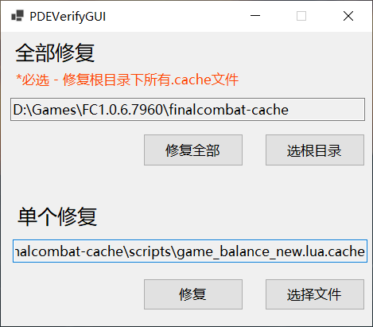

# PDEVerify GUI
    PDEVerify GUI 版本
    用于快速计算和修复文件的校验值

## 免责声明
    本工具仅用于学习交流，禁止用于非法用途，否则后果自负。

## 预览

## 使用方法
1.使用命令行的方式运行 UnPdeC.exe -cache 获得全部.cache文件

2.选择.cache的问目录！！！必选！！！

3.选择待修复的.cache文件即可

## .NET 桌面运行时
[找到.NET 桌面运行时 下载对应平台的 .NET8 桌面运行时](https://dotnet.microsoft.com/zh-cn/download/dotnet/8.0/runtime)